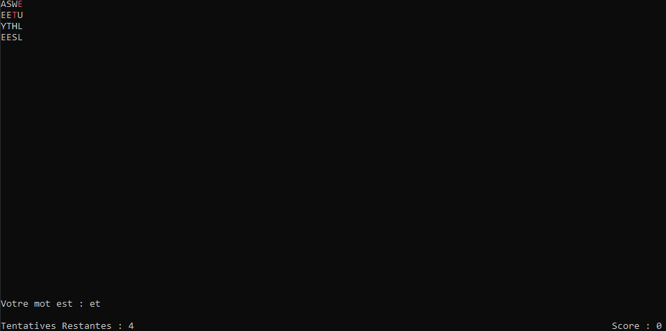

# Boggle Game
## Compilation
To compile simply use:
```
make
```
## Execution
```
./Boggle
```
## How to Play
Selected letters is highlighted, move with arrow key.

The rules for playing Boggle are as follows:<br/>

Each word should be of at least three letters.<br/>
Words that have the exact spelling but different meanings will be counted only once.<br/>
You cannot repeat any words.<br/>
You can use both singular and plural forms of the same word.<br/>
The QU cube counts as two letters.<br/>
The ‘M’ and ‘W’ cubes must be underlined for identification.

## ScreenShot

