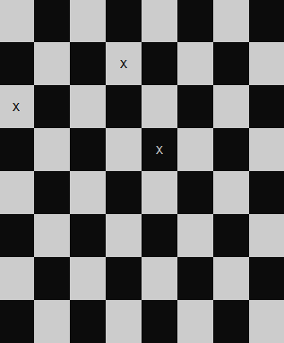

# 8 Queens Problem
## Compilation
To compile simply use:
```
make
```
## Execution
```
./Dame
```
## How to use
Left click on any square of the chessboard to add a mark "X" in it.<br/>
Right click to remove the mark.<br/>
The program will display an error message if the current board is not a valid solution to the 8 queens problem.

## ScreenShot

