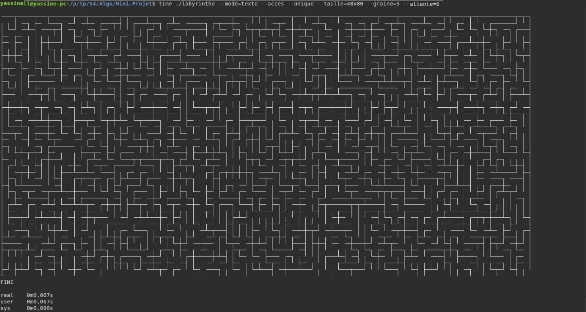
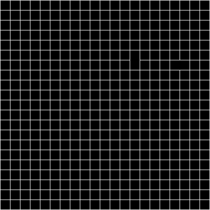

# Generating Random Labyrinth using MLV Library (IGM)
## Installation
To install go to [MLV Library](http://www-igm.univ-mlv.fr/~boussica/mlv/index.html), select your language and follow the installation instructions.
## Compile
```Shell
make
```
## Execution
```Shell
./labyrinthe [--option]
```
## How to Use
Where the options are:
▪ --unique (unique solution)
▪ --acces (makes all cells accessible, making the maze harder to solve)
▪ --mode=texte (ascii mode)
▪ --taille=HxW (with H(height) <=400 et W(width) <=300)
▪ --attente=X (speed in ms, 0 is instant, with X >= 0) (if not then wait for keyboard input)
▪ --graine=X (seed) 
By default the size is 6x8 and the mode is graphic.

## ScreenShot



## Gif

