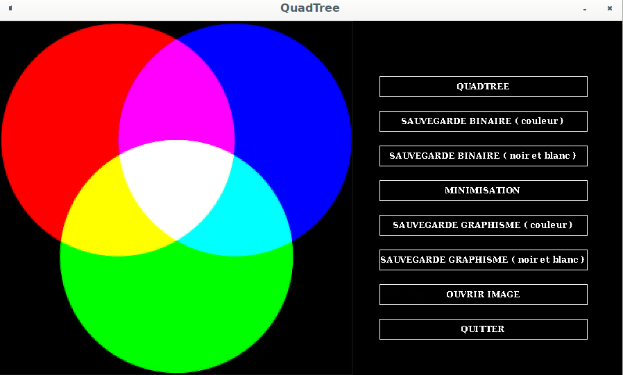
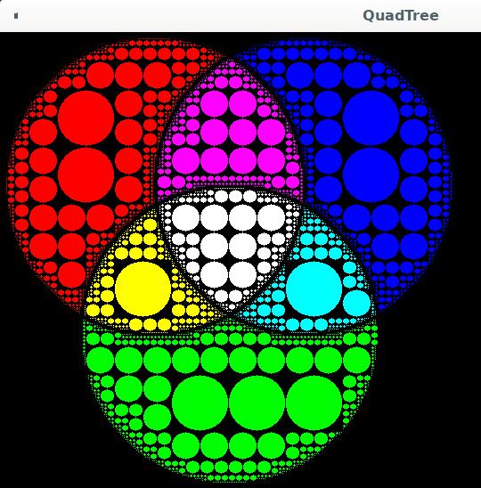

# Quadtree Compression using MLV Library (IGM)
## Installation
To install go to [MLV Library](http://www-igm.univ-mlv.fr/~boussica/mlv/index.html), select your language and follow the installation instructions.
## Compile
```
make
```
## Execution
```
./project
```
## User Manual
You can use the -help option, to show in the terminal how to use the program. And the -
circle option to display circles instead of rectangle.<br/>
The left part of the window is reserved for displaying images/quadtrees and the right part
for the menu.<br/>
The button:
<br/>▪ Quadtree is used to launch an approximation of the image in the form of Quadtree 
(slowness depends on the image).
<br/>▪ Save Binary (Black and White) makes a black-and-white binary backup of a quadtree, 
the backup bears the same name as the file or image from which the quadtree was 
built.
<br/>▪ Save (Color) makes a color backup of a quadtree, the backup bears the same name as 
the file or image from which the quadtree was built.
<br/>▪ Minimize, minimize a quadtree.
<br/>▪ Save Graph (deactivated)
<br/>▪ Open File, opens an input box where you can type the name of a file/image.
<br/>▪ Exit, leave the program.

## ScreenShots

<br/>

