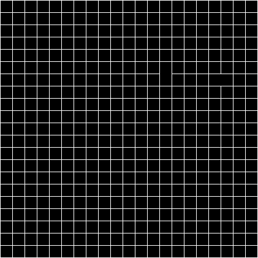

# Generating Random Labyrinth using MLV Library (IGM)
## Installation
To install go to [MLV Library](http://www-igm.univ-mlv.fr/~boussica/mlv/index.html), select your language and follow the installation instructions.
## Compile
```
make
```
## Execution
```
./labyrinthe
```
## Gif

