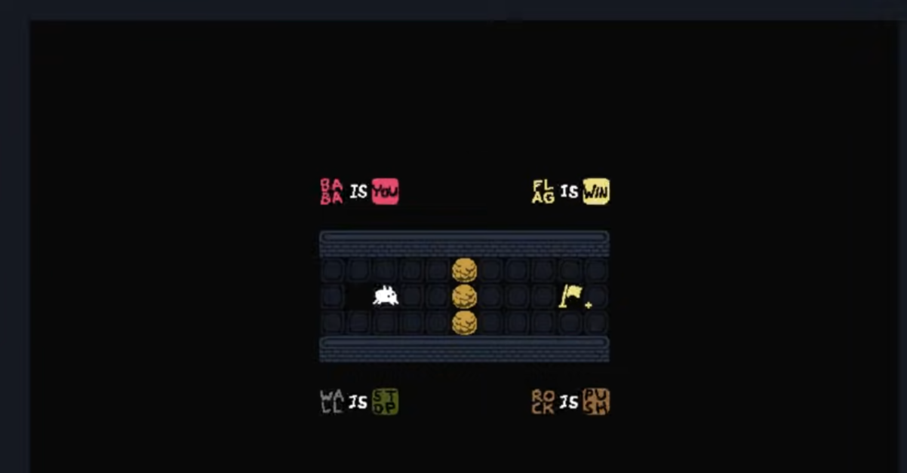
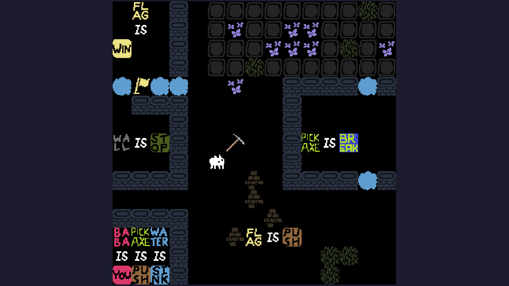

# Baba is You Clone
A clone of the game "Baba is You" in Java (in the context of a Uni project)
by Yassine (NagaYZ) ZAIANI & Abderahman BEKHTI
## Requirement
Make sure that you have:
-   Java JRE 15 installed
-   Apache Ant installed [Installation](https://ant.apache.org/manual/index.html)

## Compile
```Shell
ant jar
```
## Launching the game
Run the game with
```Shell
java --enable-preview -jar baba.jar [options]
```
Options can be the following:\
-   nothing will default to launch default-level.txt\
-   `--level [name]` with name being the name of a level (ex: level1.txt)\
-   `--levels [dirname]` with dirname being the name of a directory containing level files (here levels)\
-   `--execute [word1] IS [word2]` allows you to enable a sentence like ROCK IS FLAG (use it to cheat) there\
can be multiple --execute for the same command line.
`--level` and `--levels` are incompatible, but you can cumulate each.

It is possible to skip a level by pressing the "q" key.

Examples of valid commands:
-   `java --enable-preview -jar baba.jar`
-   `java --enable-preview -jar baba.jar --level level1.txt`
-   `java --enable-preview -jar baba.jar --levels levels --execute LAVA IS WIN`

## Controls

You, as the player, can only control entities that have the property YOU.\
You can move them with the arrow keys.

For further information on the rules, check the [Wiki](https://babaiswiki.fandom.com/wiki/Baba_Is_You_Wiki)

## Screenshot


