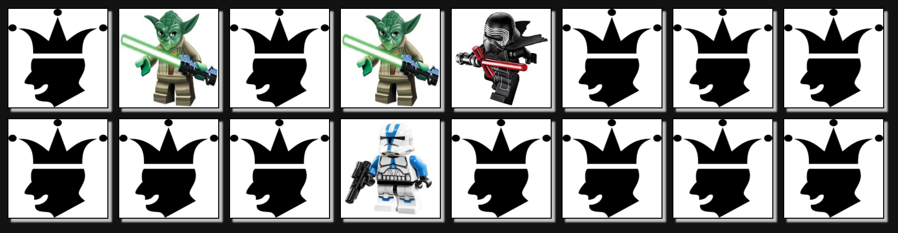

# Memory Game in Javascript
## Execution
Just double click on the "memory.html" file.
## How to play
Clicking on a card will flip it. 
The purpose of the game is to find all cards that matches.
The game is over once all pairs have been found.
## Screenshot
