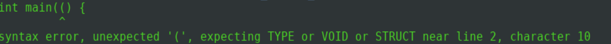

# Parser
This is a parser for TPC language, which stands for "Très Petit C", it's an extremely small and unusable subset of C defined by Université Gustave Eiffel.<br/>
It only exists as a very interesting exercise on syntax analysis.<br/><br/>
It has no data structures except for structs (which are non recursive nor nested), and has no for loops, nor pointers.<br/> The only two primitives are int and char, and the only control flow instructions are if, else, and while. The rest of the syntax is vastly equivalent to that of C.

## Execution
You can simply launch the script in the sources folder with the following command:
```Shell
./script_test.sh 
```
The script cleans the executable files and compile the parser "as" (with make) and create a "test_log.txt" file in the sources folder containing the
tests results. (0 if the test is correct, 1 otherwise).

## Manually compile
You can also compile the parser with make and run a specific test using:
```Shell
make
./as < path_of_test_file.tpc
```
## ScreenShot

