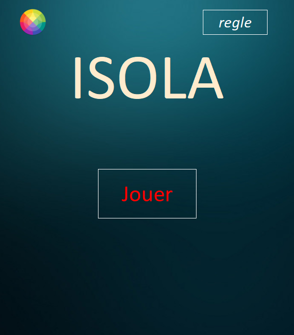
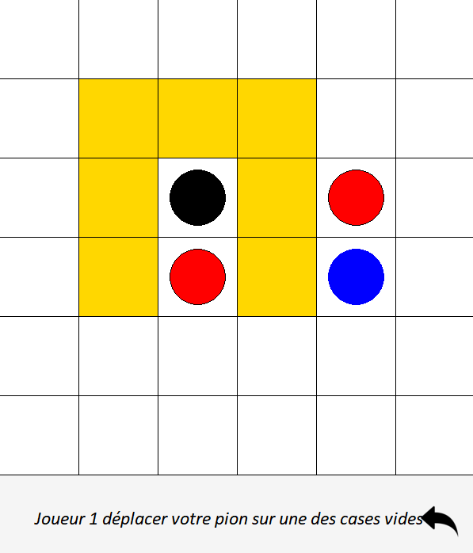
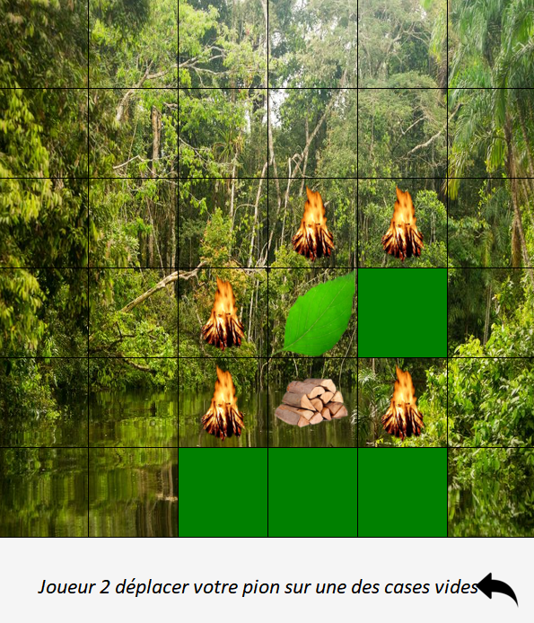

# Isola Game in Python 
Mon premier projet réalisé lors du 1er semestre de Licence en Math-Info.
Le projet utilise la librairie de l'UPEM, upemtk.py

## Execution

Launch "ISOLA.py" script.
```py
py ISOLA.py
or
py3 ISOLA.py
```

## Manuel d'utilisateur
Lors de l’exécution du code vous devez d’abord choisir la taille du plateau (dans le shell).<br/>
Sur la page d’accueil se trouve un bouton « personnalisation » en haut à gauche, permettant de changer le thème, un bouton « règle » en haut à droite et un bouton « jouer » au milieu.<br/>
Lorsque l’on clique sur le bouton « personnalisation », 3 thèmes sont proposés : « noël », « forêt », « eau », les thèmes changent le fond d’écran du plateau ainsi que les pions.<br/>
Lorsque l’on clique sur le bouton « jouer », chacun leurs tours les joueurs place la position de départ de leurs pions, ensuite la partie commence.<br/>
Des indications sont affichées dans un rectangle en bas du plateau (à qui le tour etc…)<br/>
Il y a une flèche dans ce même rectangle qui permet de revenir en arrière (comme un Ctrl + Z)<br/>
Lorsque l’un des deux joueurs à perdu, un rectangle « Recommencer » s’affiche en plein milieu de l’écran », si oui l’utilisateur est alors ramené au choix des positions de départ des pions.<br/>

## Comment jouer ?
À tour de rôle les joueurs choisissent une case vers la laquelle se déplacer (avec le clic gauche), et une case à bloquer (avec le clic droit).<br/>
Le jeu s'arrête lorsqu'un des 2 joueurs ne peut plus se déplacer.

## Capture d'écran



avec le thème forêt:
